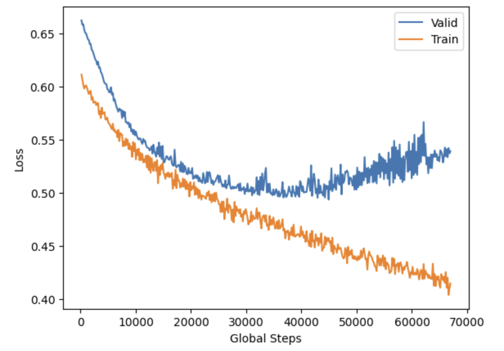

# NLP Stance Classifier
## Using TF-IDF & BERT for encoding and then Logistic Regression and LSTM for classification
This project uses headlines associated with bodies of text (articles). Classification is then used to first classify the headlines, with respect to their associated text's, into RELATED & UNRELATED. Then into DISAGREE,DISCUSS & AGREE.

Main Libraries used: SKLearn, Torch, Seaborn

